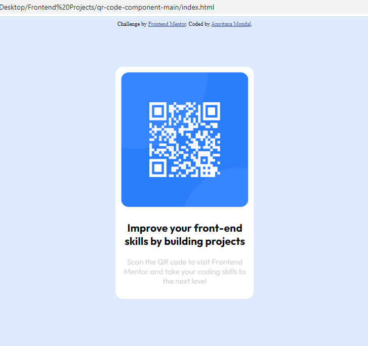

# Frontend Mentor - QR code component solution

This is a solution to the [QR code component challenge on Frontend Mentor](https://www.frontendmentor.io/challenges/qr-code-component-iux_sIO_H). Frontend Mentor challenges help you improve your coding skills by building realistic projects. 

## Table of contents

- [Overview](#overview)
  - [Screenshot](#screenshot)
  - [Links](#links)
- [My process](#my-process)
  - [Built with](#built-with)
  - [What I learned](#what-i-learned)
  - [Continued development](#continued-development)
  - [Useful resources](#useful-resources)
- [Author](#author)


## Overview
This is a qr-code-component


### Screenshot




### Links

- Solution URL: [Add solution URL here](https://github.com/MondalAmrit/Frontend-Projects.git)
- Live Site URL: [Add live site URL here](https://mondalamrit.github.io/Frontend-Projects/)

## My process

### Built with

- Semantic HTML5 markup
- CSS custom properties
- Flexbox
- CSS Grid


### What I learned

- Transform property
- Adding custom fonts

```css
.center {
    position: absolute;
    top: 50%;
    left: 50%;
    transform: translate(-50%, -50%);
}
.custom-font {
  font-family: 'Outfit', sans-serif;
}
```

### Continued development

I would like to focus on making the code responsive in the future.

### Useful resources

- [Google Fonts](https://fonts.google.com) - This helped me for exploring various fonts. I really liked this and will use it going forward.

## Author

- Frontend Mentor - [@MondalAmrit](https://www.frontendmentor.io/profile/MondalAmrit)
- Linkedin - [@Amritapa Mondal](https://www.linkedin.com/in/amritapa-mondal-065936229/)
